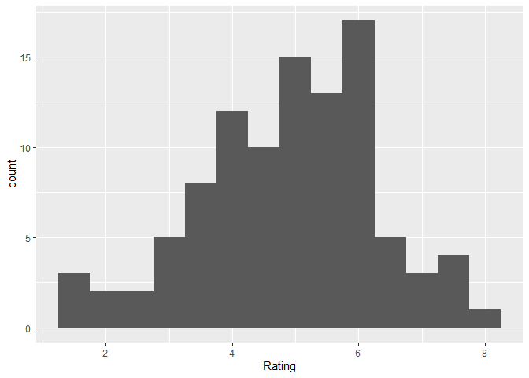
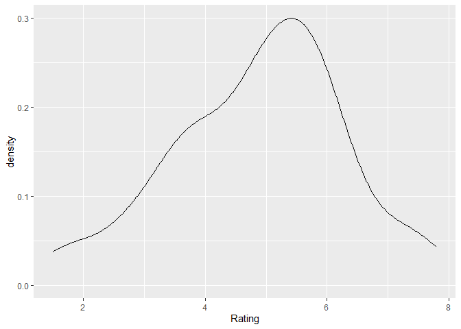
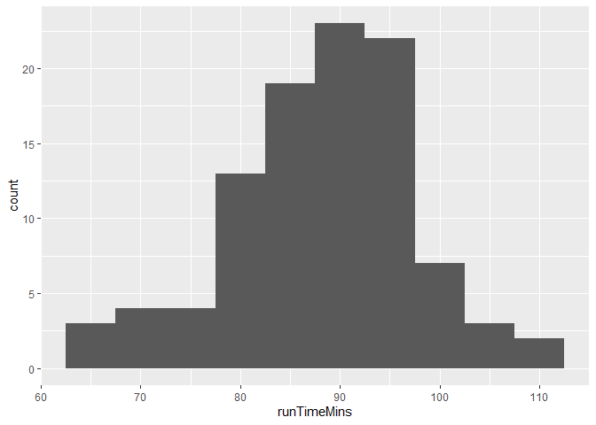
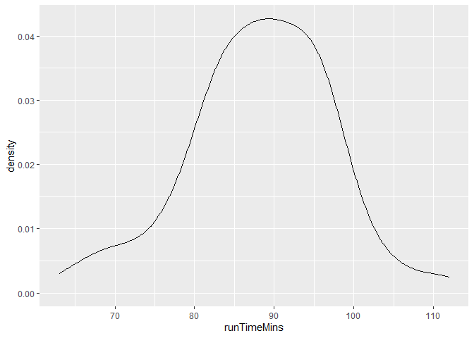

Horror Movie Analysis
================
Sebastian Hernandez
10/27/24

\##FKF

This template is a simple way to jump right into your analysis. The
libraries included are most of my used libraries and will get you
started with tidy data, ggplot, and more!

``` r
library(tidyr)
library(ggplot2)
library(ggimage)
library(dplyr)
```

    ## 
    ## Attaching package: 'dplyr'

    ## The following objects are masked from 'package:stats':
    ## 
    ##     filter, lag

    ## The following objects are masked from 'package:base':
    ## 
    ##     intersect, setdiff, setequal, union

``` r
library(readr)
library(lubridate)
```

    ## 
    ## Attaching package: 'lubridate'

    ## The following objects are masked from 'package:base':
    ## 
    ##     date, intersect, setdiff, union

``` r
library(stringr)
library(forcats)
library(quanteda)
```

    ## Package version: 4.1.0
    ## Unicode version: 15.1
    ## ICU version: 74.1

    ## Parallel computing: 12 of 12 threads used.

    ## See https://quanteda.io for tutorials and examples.

``` r
library("quanteda.textplots")
library("quanteda.textstats")
library(extrafont)
```

    ## Registering fonts with R

``` r
library(wordcloud)
```

    ## Loading required package: RColorBrewer

``` r
library(tidytext)
library(knitr)
```

    ## Warning: package 'knitr' was built under R version 4.4.2

The data used in this data set was pulled from the IMDb website with a
web scraper I created using python. I looked up B-Horror movies genre by
the most popular and pulled the top 100 titles at the time. However,
popularity changes over time and thus so will the titles that get pulled
from the web scarper. Therefore popularity is not focused on in this
analysis.

Let’s take a look at what was pulled.

``` r
horror <- read_csv('spookySZN_clean.csv')
```

    ## New names:
    ## Rows: 100 Columns: 13
    ## ── Column specification
    ## ──────────────────────────────────────────────────────── Delimiter: "," chr
    ## (9): Movie, Director, Writer1, Writer2, Star1, Star2, MovieRating, RunTi... dbl
    ## (3): ...1, Rating, Released num (1): PopularityScore
    ## ℹ Use `spec()` to retrieve the full column specification for this data. ℹ
    ## Specify the column types or set `show_col_types = FALSE` to quiet this message.
    ## • `` -> `...1`

``` r
horror
```

    ## # A tibble: 100 × 13
    ##     ...1 Movie  Rating Released Director Writer1 Writer2 Star1 Star2 MovieRating
    ##    <dbl> <chr>   <dbl>    <dbl> <chr>    <chr>   <chr>   <chr> <chr> <chr>      
    ##  1     0 Hallo…    7.7     1978 John Ca… John C… Debra … Dona… Jami… R          
    ##  2     1 The T…    7.4     1974 Tobe Ho… Kim He… Tobe H… Mari… Edwi… R          
    ##  3     2 The E…    7.4     1981 Sam Rai… Sam Ra… <NA>    Bruc… Elle… NC-17      
    ##  4     3 Tremo…    7.2     1990 Ron Und… S.S. W… Brent … Kevi… Fred… PG-13      
    ##  5     4 Frida…    6.4     1980 Sean S.… Victor… Ron Ku… Bets… Adri… R          
    ##  6     5 The B…    6.5     1999 Daniel … Daniel… Eduard… Heat… Mich… R          
    ##  7     6 Sleep…    6.2     1983 Robert … Robert… <NA>    Feli… Jona… R          
    ##  8     7 Kille…    6.2     1988 Stephen… Charle… Stephe… Gran… Suza… PG-13      
    ##  9     8 Night…    7.8     1968 George … John A… George… Duan… Judi… R          
    ## 10     9 Frida…    6.1     1981 Steve M… Ron Ku… Victor… Bets… Amy … R          
    ## # ℹ 90 more rows
    ## # ℹ 3 more variables: RunTime <chr>, Synopsis <chr>, PopularityScore <dbl>

This section focuses on some manipulation I did to the data frame to
help with my analysis.

``` r
#Want to change the data type of runTime to runTime in minutes. 
#First I will remove the 1h from the character string. 
#I will have to save this into our data frame before trying to parse out "m"
horror <- horror %>% 
  mutate(runTimeMins =str_remove(horror$RunTime, "1h "))

#parse out the "m" character
horror <- horror %>% 
  mutate(runTimeMins = str_remove(horror$runTimeMins, "m")) %>% 
  #change the datatype from chr to numeric and add 60 
  #since this is a small data set I can clearly see that all are at least an hour long and less than 2 hours
  mutate(runTimeMins = as.numeric(runTimeMins) + 60) %>%
  #Lets take a look at this by the decade
  #created a decade column to group the releases of these movies
  mutate(Decade = Released %/% 10 * 10 )


#This new dataframe will be helpful for our text analysis of our Synopsis later on
tidyHoror <- horror %>% 
  #we want to create a row for each word shown in the Synopsis variable
  unnest_tokens(word, Synopsis) %>% 
  #Lets remove stop words that will provide little to no importance
  anti_join(stop_words)
```

    ## Joining with `by = join_by(word)`

The following section focuses on summary statistics.

``` r
horror %>% 
  summary()
```

    ##       ...1          Movie               Rating         Released   
    ##  Min.   : 0.00   Length:100         Min.   :1.500   Min.   :1957  
    ##  1st Qu.:24.75   Class :character   1st Qu.:3.875   1st Qu.:1978  
    ##  Median :49.50   Mode  :character   Median :5.100   Median :1984  
    ##  Mean   :49.50                      Mean   :4.866   Mean   :1990  
    ##  3rd Qu.:74.25                      3rd Qu.:5.800   3rd Qu.:2010  
    ##  Max.   :99.00                      Max.   :7.800   Max.   :2024  
    ##                                                                   
    ##    Director           Writer1            Writer2             Star1          
    ##  Length:100         Length:100         Length:100         Length:100        
    ##  Class :character   Class :character   Class :character   Class :character  
    ##  Mode  :character   Mode  :character   Mode  :character   Mode  :character  
    ##                                                                             
    ##                                                                             
    ##                                                                             
    ##                                                                             
    ##     Star2           MovieRating          RunTime            Synopsis        
    ##  Length:100         Length:100         Length:100         Length:100        
    ##  Class :character   Class :character   Class :character   Class :character  
    ##  Mode  :character   Mode  :character   Mode  :character   Mode  :character  
    ##                                                                             
    ##                                                                             
    ##                                                                             
    ##                                                                             
    ##  PopularityScore  runTimeMins        Decade    
    ##  Min.   : 288    Min.   : 63.0   Min.   :1950  
    ##  1st Qu.: 787    1st Qu.: 83.0   1st Qu.:1970  
    ##  Median :1935    Median : 89.0   Median :1980  
    ##  Mean   :2280    Mean   : 88.2   Mean   :1986  
    ##  3rd Qu.:3921    3rd Qu.: 95.0   3rd Qu.:2010  
    ##  Max.   :4864    Max.   :112.0   Max.   :2020  
    ##  NA's   :83

``` r
#popularity score is not helpful because of how many do not have one.
#Many titles do not have a popularity score due to so many B-Horror movies being niche titles

#Let's see the distribution of ratings and the run times (in minutes) for the titles we pulled

horror %>%  
  ggplot(aes(x = Rating)) +
  geom_histogram(binwidth = .5)
```

<!-- -->

``` r
horror %>%  
  ggplot(aes(x = Rating)) +
  geom_density()
```

<!-- -->

``` r
horror %>% 
  ggplot() + 
  geom_histogram(aes(x = runTimeMins), , binwidth = 5)
```

<!-- -->

``` r
horror %>% 
  ggplot() + 
  geom_density(aes(x = runTimeMins))
```

<!-- -->

I thought it would be interesting to pull directors writers and stars.
So we do some basic counts to see if we can identify creative
professionals that continuously appear in different titles.

``` r
# Most directors only have one film in this list, but a select few have 2 or more.

horror %>% 
  count(Director) %>%
  arrange(desc(n))
```

    ## # A tibble: 88 × 2
    ##    Director                   n
    ##    <chr>                  <int>
    ##  1 Herschell Gordon Lewis     3
    ##  2 Wes Craven                 3
    ##  3 Andrew Jones               2
    ##  4 Bruno Mattei               2
    ##  5 Edward D. Wood Jr.         2
    ##  6 James Nguyen               2
    ##  7 Mark Polonia               2
    ##  8 Roger Corman               2
    ##  9 Tobe Hooper                2
    ## 10 Umberto Lenzi              2
    ## # ℹ 78 more rows

``` r
#How many times do actors appear in these movies? 
#Most are unique actors in these movies, however, a few show up in 2 titles. 

horror %>% 
  #Since we have 2 columns of Stars (Star1 and Star2) Let's make this data frame longer to include them all in one column 
  pivot_longer(Star1:Star2, names_to = "Star", values_to = "Actor") %>% 
  count(Actor) %>% 
  arrange(desc(n))
```

    ## # A tibble: 195 × 2
    ##    Actor              n
    ##    <chr>          <int>
    ##  1 Alan Bagh          2
    ##  2 Betsy Palmer       2
    ##  3 Robert Houston     2
    ##  4 Whitney Moore      2
    ##  5 William Kerwin     2
    ##  6 Adan Canto         1
    ##  7 Adrian Zmed        1
    ##  8 Adrienne King      1
    ##  9 Alicia Sanz        1
    ## 10 Allison Hayes      1
    ## # ℹ 185 more rows

``` r
#How many times does a writer appear in this data set? 
#The most prevalent writer in this data set is Wes Craven, unsurprisingly!

horror %>% 
  pivot_longer(Writer1:Writer2, names_to = "Writer", values_to = "Names") %>% 
  #remove some missing values because IMDB does not always specify a second writer, or there is none. 
  filter(!is.na(Names)) %>% 
  count(Names) %>% 
  arrange(desc(n))
```

    ## # A tibble: 155 × 2
    ##    Names                  n
    ##    <chr>              <int>
    ##  1 Wes Craven             3
    ##  2 Claudio Fragasso       2
    ##  3 Edward D. Wood Jr.     2
    ##  4 James Nguyen           2
    ##  5 John A. Russo          2
    ##  6 Ron Kurz               2
    ##  7 Victor Miller          2
    ##  8 Adam Simon             1
    ##  9 Al Ramrus              1
    ## 10 Albert Lawrence        1
    ## # ℹ 145 more rows

We focus on single variables again to see the top movies in this data
set and how many titles were released per year.

``` r
#What are the highest rated movies? 

#Top 10 B-horror movies on IMDB based on IMDB rating

horror %>%
  arrange(desc(Rating)) %>% 
  select(Movie, MovieRating, Rating ) %>%
  head(10)
```

    ## # A tibble: 10 × 3
    ##    Movie                        MovieRating Rating
    ##    <chr>                        <chr>        <dbl>
    ##  1 Night of the Living Dead     R              7.8
    ##  2 Halloween                    R              7.7
    ##  3 The Texas Chain Saw Massacre R              7.4
    ##  4 The Evil Dead                NC-17          7.4
    ##  5 Curse of the Demon           Approved       7.4
    ##  6 Tremors                      PG-13          7.2
    ##  7 Carnival of Souls            PG             7  
    ##  8 White Dog                    PG             7  
    ##  9 The Blair Witch Project      R              6.5
    ## 10 The Raven                    G              6.5

``` r
#How many releases are there by year? 

#The year with the most B-Horror titles released was 1981

horror %>% 
  count(Released) %>% 
  arrange(desc(n))
```

    ## # A tibble: 48 × 2
    ##    Released     n
    ##       <dbl> <int>
    ##  1     1981     9
    ##  2     1980     6
    ##  3     1984     6
    ##  4     2013     4
    ##  5     2022     4
    ##  6     1982     3
    ##  7     1983     3
    ##  8     1987     3
    ##  9     1990     3
    ## 10     1993     3
    ## # ℹ 38 more rows

``` r
#These are all of the titles released in 1981 from this data

horror %>% 
  filter(Released == 1981)
```

    ## # A tibble: 9 × 15
    ##    ...1 Movie   Rating Released Director Writer1 Writer2 Star1 Star2 MovieRating
    ##   <dbl> <chr>    <dbl>    <dbl> <chr>    <chr>   <chr>   <chr> <chr> <chr>      
    ## 1     2 The Ev…    7.4     1981 Sam Rai… Sam Ra… <NA>    Bruc… Elle… NC-17      
    ## 2     9 Friday…    6.1     1981 Steve M… Ron Ku… Victor… Bets… Amy … R          
    ## 3    13 The Bu…    6.3     1981 Tony Ma… Harvey… Tony M… Bria… Leah… R          
    ## 4    20 Happy …    6       1981 J. Lee … John C… Peter … Meli… Glen… R          
    ## 5    22 Saturd…    4.6     1981 Howard … Jeff B… Howard… Rich… Paul… PG         
    ## 6    33 Cannib…    5.1     1981 Umberto… Umbert… <NA>    Giov… Lorr… <NA>       
    ## 7    39 Madman     5.1     1981 Joe Gia… Joe Gi… Gary S… Gayl… Tony… R          
    ## 8    43 Absurd     5.3     1981 Joe D'A… George… <NA>    Geor… Anni… Not Rated  
    ## 9    67 Final …    4.6     1981 Jimmy H… Jimmy … <NA>    Ceci… Joel… R          
    ## # ℹ 5 more variables: RunTime <chr>, Synopsis <chr>, PopularityScore <dbl>,
    ## #   runTimeMins <dbl>, Decade <dbl>

``` r
#How many releases are there by decade? 

#Most of these B-Horror movies were released in the 80's
#We see sort of a "resurgence" of these movies in the 2010's

horror %>% 
  count(Decade) %>% 
  arrange(desc(n))
```

    ## # A tibble: 8 × 2
    ##   Decade     n
    ##    <dbl> <int>
    ## 1   1980    32
    ## 2   2010    17
    ## 3   1970    11
    ## 4   1990    11
    ## 5   1960     9
    ## 6   2020     9
    ## 7   1950     6
    ## 8   2000     5

``` r
#there was an increase in releases from the 1960's peaking in the 1980s
#Followed by a decline in releases until the 2010s. 

plot_decade <- horror %>% 
  count(Decade) %>% 
  arrange(desc(n)) %>% 
  ggplot(aes(x = Decade, y = n)) + 
  geom_line(color = "red") +
  geom_label(aes(x = Decade, y = n, label = n, vjust = .5),) + 
  theme(text = element_text(family = "Nosifer", color = "white"),
        panel.background = element_rect(fill = "black"), 
        panel.grid = element_blank(), 
        axis.line = element_line(color = "white"), 
        axis.text.y = (element_text(color = "white")), 
        axis.text.x = element_text(color = "white")) +
  labs(y = "Count of Movies", 
       title = "Number TOP B-Horror Movies by Decade", 
       subtitle = "From IMDB's 100 most popular B-Horror movies",
       caption = "Source - imdb.com\nImage-MGM")

ggbackground(plot_decade, "images/poltergeist.jpeg")
```

<!-- -->

The number of releases around the 1980’s is interesting in this data
set. Lets dig a little deeper.

``` r
#Have B-Horror movies gotten better, worse,or stayed the same over time? 

ratingPlot <- horror %>%
  select(Movie, Rating, Released) %>% 
  ggplot(aes(x = Released, y = Rating)) + 
  geom_line(color = "white") +
  geom_hline(aes(yintercept = mean(Rating)), color = "orange4") +
  theme(text = element_text(family = "Nosifer", color = "red"),
    axis.text.x = element_text(angle = 45, vjust = .75, hjust = .80, size = 10, color = "white"),
    axis.title.x = element_blank(),
    axis.ticks.x = element_line(color = "white"),
    axis.text.y = (element_text(color = "white")),
    panel.grid = element_blank())+
  labs(title = "B-Horror Movie Ratings Throughout the Years", 
       caption = "Data Source - imdb.com\nImage - evil.fandom.com/wiki/Crystal_Lake")

ggbackground(ratingPlot, "images/The_Crystal_Lake.jpeg")
```

<!-- -->

``` r
#The late 1960s through the 1980s experienced above average ratings of movies 
#Afterwards we see a loss in consistency and have a lot of volatility

plot <- horror %>% 
  arrange(desc(Rating)) %>% 
  filter(Decade >= 1960, Decade <= 1980) %>% 
  mutate(Movie = as.factor(Movie)) %>% 
  mutate(Movie = fct_reorder(Movie, Rating, .fun = sum, .desc = TRUE)) %>% 
  head(10) %>% 
  ggplot(aes(x = Movie, y = Rating)) +
  geom_col(aes(x = Movie, y = Rating), fill = "darkorange",  alpha = .66) +
 coord_cartesian(ylim=c(6,8.5))+
  geom_label(aes(x = Movie, y = Rating, label = Released)) + 
  theme(text = element_text(family = "Nosifer", color = "red"),
    axis.text.x = element_text(angle = 45, vjust = .75, hjust = .80, size = 6, color = "white"),
    axis.title.x = element_blank(),
    axis.text.y = (element_text(color = "white")),
    plot.background = element_rect(fill = "black"), 
    panel.grid = element_blank(),
    panel.grid.major = element_blank(),
    panel.grid.minor = element_blank(),
    strip.background = element_blank()) +
  labs(y = "IMDB Ratings", 
       title = "The Golden Age of B-Horror", 
       subtitle = "Highest rated B-Horror Movies from the 1960's - 1980's",
       caption = "Data Source - imdb.com\n Image - evildead.fandom.com/wiki/The_Knowby_Cabin") 

ggbackground(plot, "images/CabinExterior-EvilDead2.jpeg")
```

<!-- -->

Out of curiosity, I wanted to know how run times have changed over time.

``` r
#have movies gotten longer over time? 
#Movies seem to have gotten longer after the 1960's, but have stayed relatively the same length since the 1980's


horror %>% 
  ggplot(aes(x = Released, y = runTimeMins)) +
  geom_point() + 
  geom_smooth()
```

    ## `geom_smooth()` using method = 'loess' and formula = 'y ~ x'

<!-- -->

The remaining sections area all about text analysis. I haven’t tried my
hand at text mining / text analysis so we will be digging into the user
submitted synopsis for the 100 titles we pulled!

This sections is all about preprocessing using the quanteda package.

``` r
horror
```

    ## # A tibble: 100 × 15
    ##     ...1 Movie  Rating Released Director Writer1 Writer2 Star1 Star2 MovieRating
    ##    <dbl> <chr>   <dbl>    <dbl> <chr>    <chr>   <chr>   <chr> <chr> <chr>      
    ##  1     0 Hallo…    7.7     1978 John Ca… John C… Debra … Dona… Jami… R          
    ##  2     1 The T…    7.4     1974 Tobe Ho… Kim He… Tobe H… Mari… Edwi… R          
    ##  3     2 The E…    7.4     1981 Sam Rai… Sam Ra… <NA>    Bruc… Elle… NC-17      
    ##  4     3 Tremo…    7.2     1990 Ron Und… S.S. W… Brent … Kevi… Fred… PG-13      
    ##  5     4 Frida…    6.4     1980 Sean S.… Victor… Ron Ku… Bets… Adri… R          
    ##  6     5 The B…    6.5     1999 Daniel … Daniel… Eduard… Heat… Mich… R          
    ##  7     6 Sleep…    6.2     1983 Robert … Robert… <NA>    Feli… Jona… R          
    ##  8     7 Kille…    6.2     1988 Stephen… Charle… Stephe… Gran… Suza… PG-13      
    ##  9     8 Night…    7.8     1968 George … John A… George… Duan… Judi… R          
    ## 10     9 Frida…    6.1     1981 Steve M… Ron Ku… Victor… Bets… Amy … R          
    ## # ℹ 90 more rows
    ## # ℹ 5 more variables: RunTime <chr>, Synopsis <chr>, PopularityScore <dbl>,
    ## #   runTimeMins <dbl>, Decade <dbl>

``` r
topHorrorList <- horror %>% 
  arrange(desc(Rating)) %>% 
  select(Movie) %>% 
  head(10) %>% 
  as.vector()

topHorrorList
```

    ## $Movie
    ##  [1] "Night of the Living Dead"     "Halloween"                   
    ##  [3] "The Texas Chain Saw Massacre" "The Evil Dead"               
    ##  [5] "Curse of the Demon"           "Tremors"                     
    ##  [7] "Carnival of Souls"            "White Dog"                   
    ##  [9] "The Blair Witch Project"      "The Raven"

``` r
is.vector(topHorrorList)
```

    ## [1] TRUE

``` r
topHorrorList2 <- c("Halloween", "Night of the Living Dead", "The Texas Chain Saw Massacre", 
                   "The Evil Dead", "Curse of the Demon", "Tremors", "Carnival of Souls", "White Dog", 
                   "The Blair Witch Project", "The Raven")

is.vector(topHorrorList2)
```

    ## [1] TRUE

``` r
horrorcorp = corpus(horror,text_field = "Synopsis")

dtm <- dfm(tokens(horrorcorp, remove_punct = TRUE, 
                  remove_symbols = TRUE, 
                  remove_separators = TRUE, remove_numbers = TRUE), tolower = TRUE) %>%
  dfm_remove(stopwords('en')) %>% 
  dfm_trim(min_termfreq = 8) 

dtm
```

    ## Document-feature matrix of: 100 documents, 50 features (90.58% sparse) and 14 docvars.
    ##        features
    ## docs    night police death years one find dr back time town
    ##   text1     2      1     1     1   1    1  1    1    1    1
    ##   text2     0      0     0     0   0    0  0    0    0    0
    ##   text3     0      0     0     0   3    1  0    0    1    0
    ##   text4     0      0     0     0   2    0  0    0    1    2
    ##   text5     0      0     0     0   2    0  0    0    0    0
    ##   text6     0      0     0     0   1    1  0    0    0    0
    ## [ reached max_ndoc ... 94 more documents, reached max_nfeat ... 40 more features ]

``` r
horror2corp = horror %>% 
  arrange(desc(Rating)) %>% 
  filter(Decade >= 1960, Decade <= 1980) %>% 
  corpus(text_field = "Synopsis")

dtm2 <- dfm(tokens(horror2corp, remove_punct = TRUE, 
                  remove_symbols = TRUE, 
                  remove_separators = TRUE, remove_numbers = TRUE), tolower = TRUE) %>%
  dfm_remove(stopwords('en')) %>% 
  dfm_trim(min_termfreq = 6)


horror_dfm <- tidyHoror %>%  
  filter(Movie %in% topHorrorList2) %>%
  count(Movie, word, sort = TRUE) %>% 
  cast_dfm(Movie, word, n)
```

Now let’s make a simple word cloud for all of the titles. Also, for
movies released during the 1960s and 1980s

``` r
dtm %>% 
  dfm_remove(c('>', '<', 'one', 'ed', 'however', 'goes')) %>%
  textplot_wordcloud(color = "darkred", ordered_color = T) 
```

<!-- -->

``` r
dtm %>% 
  dfm_remove(c('>', '<', 'one', 'ed', 'however', 'goes')) %>%
  textstat_frequency(n = 50) 
```

    ##       feature frequency rank docfreq group
    ## 1         new        22    1      18   all
    ## 2        town        21    2      14   all
    ## 3      people        20    3      17   all
    ## 4        find        17    4      16   all
    ## 5       house        17    4      10   all
    ## 6         two        16    6      13   all
    ## 7        back        15    7      14   all
    ## 8      family        15    7      11   all
    ## 9       years        14    9      13   all
    ## 10      night        13   10       9   all
    ## 11       soon        13   10      12   all
    ## 12     killer        13   10      12   all
    ## 13       dead        12   13      10   all
    ## 14       camp        12   13       7   all
    ## 15      group        12   13      10   all
    ## 16     police        11   16      10   all
    ## 17      young        11   16      11   all
    ## 18       life        11   16      10   all
    ## 19      human        11   16      10   all
    ## 20         dr        10   20       9   all
    ## 21       take        10   20      10   all
    ## 22     escape        10   20       9   all
    ## 23 mysterious        10   20       9   all
    ## 24       time         9   24       9   all
    ## 25    friends         9   24       8   all
    ## 26     killed         9   24       6   all
    ## 27      local         9   24       9   all
    ## 28        now         9   24       9   all
    ## 29      later         9   24       9   all
    ## 30       must         9   24       9   all
    ## 31       body         9   24       9   all
    ## 32      death         8   32       7   all
    ## 33   students         8   32       8   all
    ## 34       evil         8   32       5   all
    ## 35      takes         8   32       8   all
    ## 36      jason         8   32       3   all
    ## 37       lake         8   32       3   all
    ## 38    zombies         8   32       6   all
    ## 39     around         8   32       8   all
    ## 40       base         8   32       4   all
    ## 41      begin         8   32       8   all
    ## 42       also         8   32       8   all
    ## 43    colonel         8   32       2   all
    ## 44      party         8   32       6   all
    ## 45     father         8   32       6   all
    ## 46      blood         8   32       7   all

``` r
#Since most of the above average rated movies were between the 1960's and the 1990's I decided to make a wordcloud for this era

dtm2 %>%   
  dfm_remove(c('>', '<', 'one', 'ed', 'humberto', 'amador', 'norman', 'also')) %>%
  textplot_wordcloud() 
```

<!-- -->

The focus will now be on the top 10 rated movies in the data set. I want
to explore what words carry the most weight in their synopsis This
remainder of this analysis was guided/inspired by Julie Siege’s topic
modeling tutorials.

If you would like to see more of Julie Silge’s work you can take a look
at her blog here: <https://juliasilge.com/blog/> She is a great data
scientist and prevelant figure in the R community!

``` r
tidyHoror %>% 
  filter(Movie %in% topHorrorList2) %>% 
  count(Movie, word, sort = TRUE) %>% 
  bind_tf_idf(word, Movie, n) %>% 
  group_by(Movie) %>% 
  slice_max(word, n = 3) %>% 
  ungroup() %>% 
  mutate(word = reorder(word, tf_idf)) %>% 
  ggplot(aes(word, tf_idf, fill = Movie)) + 
  geom_col(show.legend = FALSE) + 
  facet_wrap(~Movie, scales = "free") + 
  coord_flip()
```

<!-- -->

``` r
library(stm)
```

    ## stm v1.3.7 successfully loaded. See ?stm for help. 
    ##  Papers, resources, and other materials at structuraltopicmodel.com

``` r
tidyHorror_dfm <- tidyHoror %>% 
  count(Movie, word, sort = TRUE) %>% 
  filter(word !="10") %>% 
  filter(word !="11944") %>% 
  filter(word != "_tremors_") %>% 
  cast_dfm(Movie, word, n)

topic_model <- stm(tidyHorror_dfm, K = 6, init.type = "Spectral")
```

    ## Beginning Spectral Initialization 
    ##   Calculating the gram matrix...
    ##   Finding anchor words...
    ##      ......
    ##   Recovering initialization...
    ##      ......................
    ## Initialization complete.
    ## ....................................................................................................
    ## Completed E-Step (0 seconds). 
    ## Completed M-Step. 
    ## Completing Iteration 1 (approx. per word bound = -7.264) 
    ## ....................................................................................................
    ## Completed E-Step (0 seconds). 
    ## Completed M-Step. 
    ## Completing Iteration 2 (approx. per word bound = -6.600, relative change = 9.140e-02) 
    ## ....................................................................................................
    ## Completed E-Step (0 seconds). 
    ## Completed M-Step. 
    ## Completing Iteration 3 (approx. per word bound = -6.430, relative change = 2.581e-02) 
    ## ....................................................................................................
    ## Completed E-Step (0 seconds). 
    ## Completed M-Step. 
    ## Completing Iteration 4 (approx. per word bound = -6.395, relative change = 5.439e-03) 
    ## ....................................................................................................
    ## Completed E-Step (0 seconds). 
    ## Completed M-Step. 
    ## Completing Iteration 5 (approx. per word bound = -6.390, relative change = 8.146e-04) 
    ## Topic 1: town, family, creature, hunt, house 
    ##  Topic 2: accident, students, dead, jason, dr 
    ##  Topic 3: house, life, night, police, ed 
    ##  Topic 4: killer, camp, killed, people, start 
    ##  Topic 5: colonel, julie, base, secret, human 
    ##  Topic 6: josh, blood, missing, todd, mike 
    ## ....................................................................................................
    ## Completed E-Step (0 seconds). 
    ## Completed M-Step. 
    ## Completing Iteration 6 (approx. per word bound = -6.384, relative change = 8.975e-04) 
    ## ....................................................................................................
    ## Completed E-Step (0 seconds). 
    ## Completed M-Step. 
    ## Completing Iteration 7 (approx. per word bound = -6.381, relative change = 4.600e-04) 
    ## ....................................................................................................
    ## Completed E-Step (0 seconds). 
    ## Completed M-Step. 
    ## Completing Iteration 8 (approx. per word bound = -6.379, relative change = 2.916e-04) 
    ## ....................................................................................................
    ## Completed E-Step (0 seconds). 
    ## Completed M-Step. 
    ## Completing Iteration 9 (approx. per word bound = -6.379, relative change = 5.422e-05) 
    ## ....................................................................................................
    ## Completed E-Step (0 seconds). 
    ## Completed M-Step. 
    ## Model Converged

``` r
summary(topic_model)
```

    ## A topic model with 6 topics, 100 documents and a 2230 word dictionary.

    ## Topic 1 Top Words:
    ##       Highest Prob: town, creature, family, house, home, christmas, escape 
    ##       FREX: creature, christmas, home, town, figure, shock, torgo 
    ##       Lift: shock, torgo, tourists, 2, 2010, apparently, attic 
    ##       Score: legendary, creature, christmas, torgo, tourists, shock, mountain 
    ## Topic 2 Top Words:
    ##       Highest Prob: accident, students, dead, jason, dr, nancy, doctor 
    ##       FREX: holden, horrible, jimmy, karswell, nest, prom, spiders 
    ##       Lift: 18th, 1961, 23, 9, acula, affair, aided 
    ##       Score: frankenstein, accident, nancy, holden, karswell, horrible, jimmy 
    ## Topic 3 Top Words:
    ##       Highest Prob: house, life, night, police, ed, begin, mary 
    ##       FREX: bukowski, barbra, criminals, days, gang, phyllis, tom 
    ##       Lift: accept, accrues, addicted, advantage, affected, agatha, agatha's 
    ##       Score: musicians, house, bukowski, mary, criminals, phyllis, tom 
    ## Topic 4 Top Words:
    ##       Highest Prob: killer, camp, killed, people, start, lake, maze 
    ##       FREX: maze, dallas, nico, alice, crystal, beth, rogue 
    ##       Lift: game, jan, l.a, maze, murderer, play, 1907 
    ##       Score: 1907, maze, crystal, start, killer, dallas, nico 
    ## Topic 5 Top Words:
    ##       Highest Prob: colonel, julie, base, secret, human, reynolds, people 
    ##       FREX: julie, reynolds, curt, skin, causing, control, project 
    ##       Lift: 11th, 1981, abound, acid, actress, adams, advertising 
    ##       Score: all's, julie, reynolds, colonel, curt, skin, base 
    ## Topic 6 Top Words:
    ##       Highest Prob: josh, blood, missing, mike, todd, local, escaped 
    ##       FREX: josh, todd, mike, escaped, blood, missing, terry 
    ##       Lift: terry, toxic, attractive, blamed, bloody, boys, brothers 
    ##       Score: descend, todd, josh, terry, toxic, escaped, mike

``` r
td_beta <- tidy(topic_model)

td_beta %>% 
  group_by(topic) %>% 
  slice_max(beta, n = 10) %>% 
  ungroup() %>% 
  mutate(term = reorder(term, beta)) %>% 
  ggplot(aes(term, beta, fill = term)) + 
  geom_col(show.legend = FALSE) + 
  facet_wrap(~topic, scales = "free") + 
  coord_flip()
```

<!-- -->

``` r
td_gamma <- tidy(topic_model, matrix = "gamma", 
                 document_names = rownames(tidyHorror_dfm))

td_gamma %>% 
  ggplot(aes(gamma, fill = as.factor(topic))) + 
           geom_histogram(show.legend = FALSE) + 
           facet_wrap(~topic, ncol = 3)
```

    ## `stat_bin()` using `bins = 30`. Pick better value with `binwidth`.

<!-- -->
